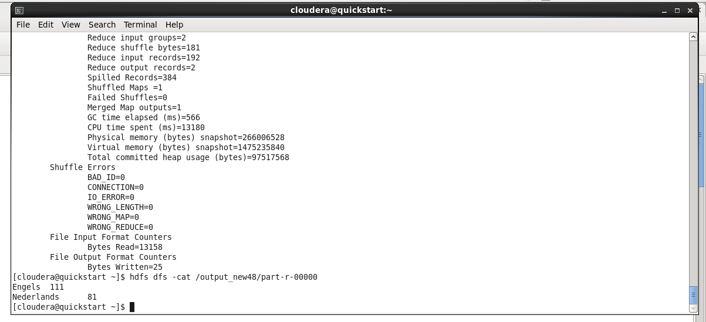
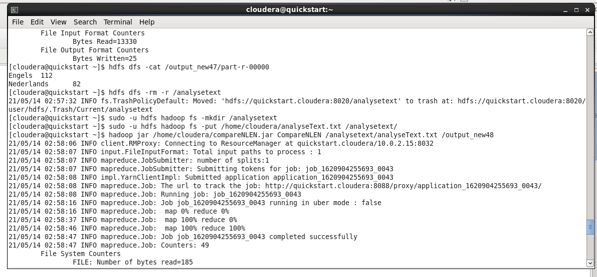

# BDSD Assignment 2:
## Letterfrequenties

De output van de totale code die we runnen op het door de HU gegeven bestand:  

De code werkt goed als er 73 Nederlandstalige en 119 Engelstalige regels worden herkend.  
Zoals in de screenshot hierboven te zien is, herkent het programma **81 Nederlandstalige en 111 Engelstalige** regels.

Dit betekent dat:  
Van de in totaal 192 regels er 8 foutief worden herkend.  
Ofterwijl: 184 regels van de 192 worden juist herkend.  

184 / 192 * 100% = een accuratie van **95.83%**

___

De output van het runnen van de code van de JAR:  

Zoals in de afbeelding hierboven te zien is, draait de code zonder complicaties.  
